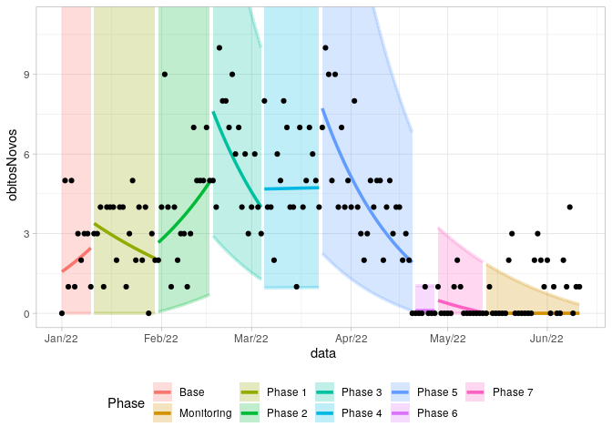
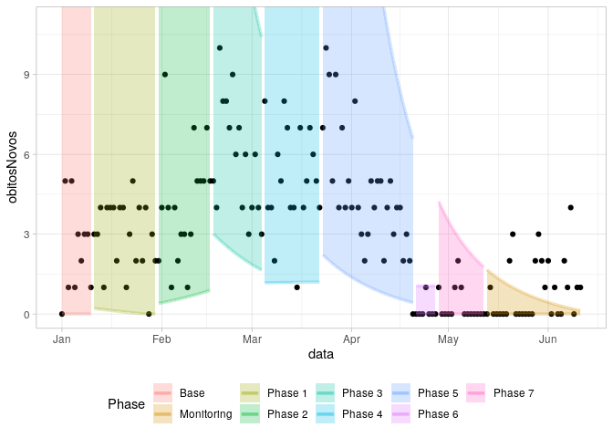
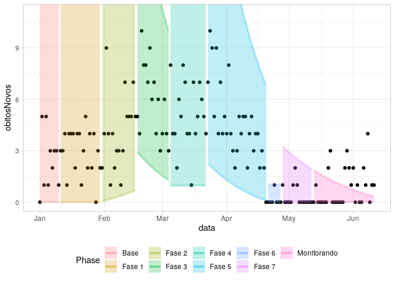

Shewhart plots in R
================

## Installation

To install from Github you can use the `install_github` command from the
`devtools` package:

``` r
devtools::install_github("castlaboratory/Shewhart")
```

## Usage

### Data

``` r
cvd_recife <- read_rds(system.file("extdata", package = "Shewhart", file = "recife_2002_covid19.rds"))

cvd_recife %>% glimpse()
```

    ## Rows: 162
    ## Columns: 2
    ## $ data        <date> 2022-01-01, 2022-01-02, 2022-01-03, 2022-01-04, 2022-01-0…
    ## $ obitosNovos <dbl> 0, 5, 1, 5, 1, 3, 2, 3, 3, 1, 3, 3, 4, 1, 4, 4, 4, 2, 4, 4…

### GGPLOT

``` r
shewhart(data = cvd_recife, 
         index_col = data,
         values_col = obitosNovos, 
         locale = "en_US")
```

<!-- -->

``` r
shewhart(data = cvd_recife, 
         index_col = data,
         values_col = obitosNovos, 
         model = "loglog",
         locale = "en_US")
```

<!-- -->

### PLOTLY

``` r
shewhart(data = cvd_recife, 
         index_col = data,
         values_col = obitosNovos, 
         locale = "en_US", 
         model = "log",
         type = "plotly")
```

### Autodetect phases

You can use the 7-point rule with the command `shewhart_7points`

``` r
phase_dates <- shewhart_7points(data = cvd_recife, 
                                index_col = data, 
                                values_col = obitosNovos)
print(phase_dates)
```

    ## [1] "2022-01-11" "2022-01-31" "2022-02-17" "2022-03-05" "2022-03-23"
    ## [6] "2022-04-21" "2022-04-28" "2022-05-13"

You can get de model using these dates with the command `shewhart_model`

``` r
shwt_model <- shewhart_model(data = cvd_recife,
                             index_col = data,
                             values_col = obitosNovos, 
                             phase_changes = phase_dates)

shwt_model %>% head()
```

    ## # A tibble: 6 × 18
    ##   phase data       obitosNovos change model  flag     N fit    tidied   fitted
    ##   <int> <date>           <dbl> <lgl>  <chr> <int> <int> <list> <list>    <dbl>
    ## 1     0 2022-01-01           0 FALSE  log       0     1 <lm>   <tibble>  0.943
    ## 2     0 2022-01-02           5 FALSE  log       0     2 <lm>   <tibble>  0.976
    ## 3     0 2022-01-03           1 FALSE  log       0     3 <lm>   <tibble>  1.01 
    ## 4     0 2022-01-04           5 FALSE  log       0     4 <lm>   <tibble>  1.04 
    ## 5     0 2022-01-05           1 FALSE  log       0     5 <lm>   <tibble>  1.08 
    ## 6     0 2022-01-06           3 FALSE  log       0     6 <lm>   <tibble>  1.11 
    ## # … with 8 more variables: residuals <dbl>, CONL_1 <dbl>, UCL <dbl>, LCL <dbl>,
    ## #   CL <dbl>, UL_EXP <dbl>, LL_EXP <dbl>, phase_string <chr>

If you already have the dates or the model you can use it to make the
plot

``` r
shewhart(data = cvd_recife, 
         index_col = data,
         values_col = obitosNovos, 
         model = "loglog",
         locale = "en_US",
         phase_changes = phase_dates)
```

<!-- -->

``` r
shewhart(data = shwt_model, 
         index_col = data,
         values_col = obitosNovos, 
         model = "loglog",
         locale = "en_US")
```

<!-- -->

## Depedencies

this package depends of:

-   lubridate (\>= 1.8.0),
-   tidyverse (\>= 1.3.0),
-   tibbletime (\>= 0.1.6),
-   tidymodels (\>= 1.0.0),
-   pals (\>= 1.7),
-   scales (\>= 1.2.1),
-   plotly (\>= 4.1)

## Stay Tuned

Please visit the [castlab.org](https://castlab.org) for latest updates
and news.
