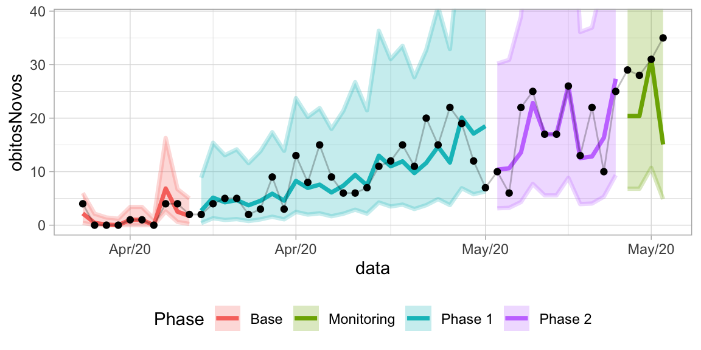

<!-- README.md is generated from README.Rmd. Please edit that file -->

# Shewhart <a href="https://github.com/castlaboratory/Shewhart"></a>

<!-- badges: start -->


<!-- badges: end -->

The goal of Shewhart is to provide a streamlined workflow for detecting
and modeling process phase changes using Shewhart control charts. It
features tools for fitting common transformations (log, log-log,
Gompertz), identifying phases via the “7 consecutive points” rule, and
computing control limits on both transformed and original scales. The
package leverages the tidyverse for intuitive data manipulation and is
designed to be easily integrated into broader data analysis pipelines.

## Installation

You can install the development version of Shewhart from
[GitHub](https://github.com/castlaboratory/Shewhart) with:

``` r
# install.packages("pak")
pak::pak("castlaboratory/Shewhart")
```

## Usage Overview

This package provides functions for creating and analyzing **Shewhart
control charts** (using either **ggplot2** or **plotly**) and detecting
potential phase changes via the “7 consecutive points” rule. Key
functions include:

- `shewhart()`: Creates the control chart plot (either ggplot2 or
  plotly).
- `shewhart_7points()`: Detects phase changes by checking for 7
  consecutive points above or below the central line.
- `shewhart_model()`: Builds a data frame (or tibble) with annotated
  phase information and control limits.
- `shewhart_fit()`: Internally fits the specified model (e.g., “log”,
  “loglog”, or “gompertz”).

## Example Data

For demonstration, we’ll use a dataset (`cvd_recife`) included in the
package:

``` r

cvd_recife <- readr::read_rds(
  system.file("extdata", 
              package = "Shewhart", 
              file = "recife_2020_covid19.rds")
) %>% 
  slice_head(n = 50)

cvd_recife %>% 
  glimpse()
#> Rows: 50
#> Columns: 2
#> $ data        <date> 2020-03-28, 2020-03-29, 2020-03-30, 2020-03-31, 2020-04-0…
#> $ obitosNovos <int> 4, 0, 0, 0, 1, 1, 0, 4, 4, 2, 2, 4, 5, 5, 2, 3, 9, 3, 13, …
```

In this dataset, `data` is a date column, and `obitosNovos` are new
daily deaths (integer counts).

### Plotting with ggplot2

You can create a **ggplot2**-based Shewhart chart simply by setting
`type = "ggplot"` (the default). The `shewhart()` function will detect
whether the dataset already has phase information—if not, it internally
calls `shewhart_7points()` and `shewhart_model()`.

``` r
shewhart(
  data       = cvd_recife, 
  index_col  = data,
  values_col = obitosNovos, 
  locale     = "en_US"
)
```


You can specify a different model (e.g., “loglog”):

``` r
shewhart(
  data       = cvd_recife, 
  index_col  = data,
  values_col = obitosNovos, 
  model      = "loglog",
  locale     = "en_US"
)
```


In the next example, we first add a new factor column `wd` to the
cvd_recife dataset by extracting the day of the week from the data
column. By specifying `dummy_col = wd` in the `shewhart()` call, we
allow the underlying Shewhart model (here using `model = "log"`) to
account for potential day-of-week effects. In other words, each weekday
becomes a “dummy” factor that might influence the estimated control
limits, helping reveal whether there are systematic shifts or patterns
associated with particular days. We also set locale = “en_US” so that
date labels and text are formatted in English.

``` r
shewhart(data = cvd_recife %>% mutate(wd = factor(wday(data))), 
         index_col = data,
         values_col = obitosNovos, 
         model = "log",
         dummy_col = wd,
         locale = "en_US")
```



``` r
shewhart(data = cvd_recife %>% mutate(wd = factor(wday(data))), 
         index_col = data,
         values_col = obitosNovos, 
         model = "loglog",
         dummy_col = wd,
         locale = "en_US")
```


### Plotting with plotly

To generate an **interactive** chart with **plotly**, set
`type = "plotly"`:

``` r
shewhart(
  data       = cvd_recife, 
  index_col  = data,
  values_col = obitosNovos, 
  locale     = "en_US", 
  model      = "log",
  type       = "plotly"
)
```

Hover over points or ribbons to see tooltips, zoom in/out, and more.

## Autodetecting Phases

You can explicitly detect phase changes using the **7-point rule** via
`shewhart_7points()`:

``` r
phase_dates <- shewhart_7points(
  data       = cvd_recife, 
  index_col  = data, 
  values_col = obitosNovos
)

print(phase_dates)
#> [1] "2020-04-07" "2020-05-06"
```

## Building a Model for Custom Usage

You can also build the phase model data frame yourself by calling
`shewhart_model()`, passing the detected phase changes:

``` r
shwt_model <- shewhart_model(
  data          = cvd_recife,
  index_col     = data,
  values_col    = obitosNovos, 
  phase_changes = phase_dates
)

shwt_model %>% head()
#> # A tibble: 6 × 18
#>   phase data       obitosNovos change model  flag     N fit    tidied   fitted
#>   <int> <date>           <int> <lgl>  <chr> <int> <int> <list> <list>    <dbl>
#> 1     0 2020-03-28           4 FALSE  log       0     1 <lm>   <tibble>  0.330
#> 2     0 2020-03-29           0 FALSE  log       0     2 <lm>   <tibble>  0.419
#> 3     0 2020-03-30           0 FALSE  log       0     3 <lm>   <tibble>  0.508
#> 4     0 2020-03-31           0 FALSE  log       0     4 <lm>   <tibble>  0.598
#> 5     0 2020-04-01           1 FALSE  log       0     5 <lm>   <tibble>  0.687
#> 6     0 2020-04-02           1 FALSE  log       0     6 <lm>   <tibble>  0.776
#> # ℹ 8 more variables: residuals <dbl>, CONL_1 <dbl>, UCL <dbl>, LCL <dbl>,
#> #   CL <dbl>, UL_EXP <dbl>, LL_EXP <dbl>, phase_string <chr>
```

This tibble now has columns like `phase`, `CL`, `UL_EXP`, `LL_EXP`,
etc., which can be used directly in your custom plots or analyses.

## Reusing an Existing Model or Phase Changes

If you already have the `phase_changes` or the annotated data frame from
`shewhart_model`, you can pass them to `shewhart()` to avoid
recalculating:

``` r
# Using phase_changes explicitly:
shewhart(
  data          = cvd_recife, 
  index_col     = data,
  values_col    = obitosNovos, 
  model         = "loglog",
  locale        = "en_US",
  phase_changes = phase_dates
)
```


``` r

# Or using the 'shwt_model' directly:
shewhart(
  data       = shwt_model, 
  index_col  = data,
  values_col = obitosNovos, 
  model      = "loglog",
  locale     = "en_US"
)
```


Both approaches yield the same final plot but skip re-running the
7-point detection or the modeling if the data is already annotated.

## Dependencies

This package uses:

- **lubridate (\>= 1.8.0)** for date handling and wday extraction  
- **tidyverse (\>= 1.3.0)** for data manipulation (dplyr, tidyr, etc.)  
- **tibbletime (\>= 0.1.6)** or **slider** for rolling sum
  calculations  
- **tidymodels (\>= 1.0.0)** for modeling convenience  
- **pals (\>= 1.7)** and **scales (\>= 1.2.1)** for color palettes and
  scaling  
- **plotly (\>= 4.1)** for interactive plots

Ensure these are installed and loaded (as needed) before using
`Shewhart`.

## More Information

Visit <https://castlab.org> for updates and other packages/research from
the CASTLab team. If you have suggestions or encounter issues, please
open an Issue on
[GitHub](https://github.com/castlaboratory/Shewhart/issues) or contact
us at <leite@castlab.org>.

Happy charting!
