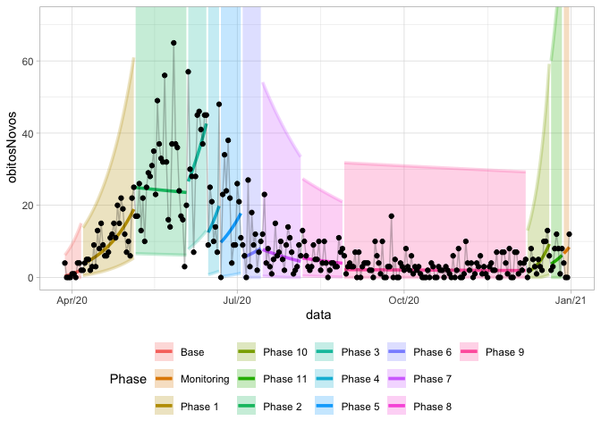
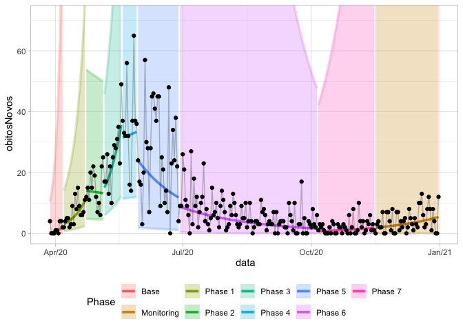
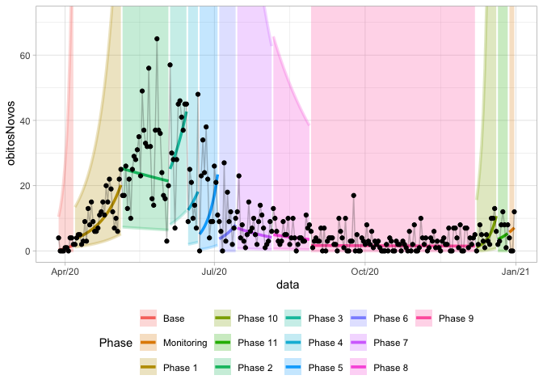

Shewhart plots in R
================

## Installation

To install the `package` from Github you can use the `install_github`
command from the `devtools` package:

``` r
devtools::install_github("castlaboratory/Shewhart")
```

You could also download the repository and install via local package
installation on R.

``` r
install.packages("Shewhart.zip", repos = NULL)
```

## Usage

### Data

``` r
cvd_recife <- read_rds(system.file("extdata", package = "Shewhart", file = "recife_2020_covid19.rds"))

cvd_recife %>% glimpse()
```

    ## Rows: 279
    ## Columns: 2
    ## $ data        <date> 2020-03-28, 2020-03-29, 2020-03-30, 2020-03-31, 2020-04-0…
    ## $ obitosNovos <int> 4, 0, 0, 0, 1, 1, 0, 4, 4, 2, 2, 4, 5, 5, 2, 3, 9, 3, 13, …

### GGPLOT

``` r
shewhart(data = cvd_recife, 
         index_col = data,
         values_col = obitosNovos, 
         locale = "en_US")
```

<!-- -->

``` r
shewhart(data = cvd_recife, 
         index_col = data,
         values_col = obitosNovos, 
         model = "loglog",
         locale = "en_US")
```

<!-- -->

### PLOTLY

``` r
shewhart(data = cvd_recife, 
         index_col = data,
         values_col = obitosNovos, 
         locale = "en_US", 
         model = "log",
         type = "plotly")
```

### Autodetect phases

You can use the 7-point rule with the command `shewhart_7points`

``` r
phase_dates <- shewhart_7points(data = cvd_recife, 
                                index_col = data, 
                                values_col = obitosNovos)
print(phase_dates)
```

    ##  [1] "2020-04-07" "2020-05-06" "2020-06-04" "2020-06-15" "2020-06-22"
    ##  [6] "2020-07-04" "2020-07-15" "2020-08-06" "2020-08-29" "2020-12-08"
    ## [11] "2020-12-21" "2020-12-28"

You can get de model using these dates with the command `shewhart_model`

``` r
shwt_model <- shewhart_model(data = cvd_recife,
                             index_col = data,
                             values_col = obitosNovos, 
                             phase_changes = phase_dates)

shwt_model %>% head()
```

    ## # A tibble: 6 × 18
    ##   phase data       obitosNovos change model  flag     N fit    tidied   fitted
    ##   <int> <date>           <int> <lgl>  <chr> <int> <int> <list> <list>    <dbl>
    ## 1     0 2020-03-28           4 FALSE  log       0     1 <lm>   <tibble>  0.330
    ## 2     0 2020-03-29           0 FALSE  log       0     2 <lm>   <tibble>  0.419
    ## 3     0 2020-03-30           0 FALSE  log       0     3 <lm>   <tibble>  0.508
    ## 4     0 2020-03-31           0 FALSE  log       0     4 <lm>   <tibble>  0.598
    ## 5     0 2020-04-01           1 FALSE  log       0     5 <lm>   <tibble>  0.687
    ## 6     0 2020-04-02           1 FALSE  log       0     6 <lm>   <tibble>  0.776
    ## # … with 8 more variables: residuals <dbl>, CONL_1 <dbl>, UCL <dbl>, LCL <dbl>,
    ## #   CL <dbl>, UL_EXP <dbl>, LL_EXP <dbl>, phase_string <chr>

If you already have the dates or the model you can use it to make the
plot

``` r
shewhart(data = cvd_recife, 
         index_col = data,
         values_col = obitosNovos, 
         model = "loglog",
         locale = "en_US",
         phase_changes = phase_dates)
```

<!-- -->

``` r
shewhart(data = shwt_model, 
         index_col = data,
         values_col = obitosNovos, 
         model = "loglog",
         locale = "en_US")
```

<!-- -->

## Depedencies

this package depends of:

-   lubridate (\>= 1.8.0),
-   tidyverse (\>= 1.3.0),
-   tibbletime (\>= 0.1.6),
-   tidymodels (\>= 1.0.0),
-   pals (\>= 1.7),
-   scales (\>= 1.2.1),
-   plotly (\>= 4.1)

## Stay Tuned

Please visit the [castlab.org](https://castlab.org) for latest updates
and news.
